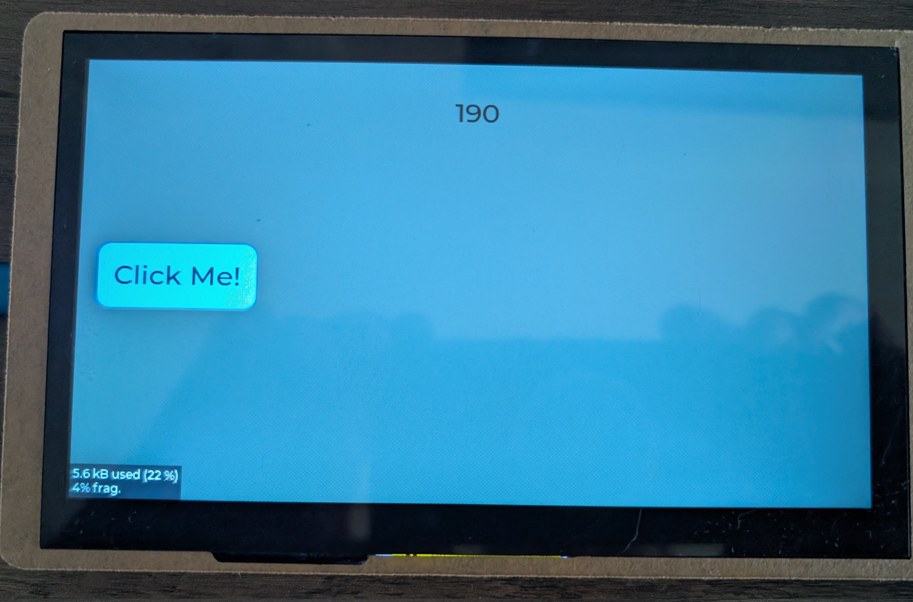

 # Introduction
 This has been a long road to reach the point where I can use the DPI peripheral and 
 Embassy on an ESP32-S3 development board with a display. I switched from using 
 `lv-binding-rust` because the developers do not seem to want to make changes, a lot
 of widgets were not supported, and I wanted the flexibility to use any version of LVGL. 

 While this code uses LVGL v8.4, it could easily be updated to use LVGL v9.x. 
 The `build.rs` file contains the appropriate code that could be modified if 
 necessary. I kept the GUI page creation in "C" style code 
 mainly because there are so many examples available written in C that can easily 
 be ported into any application without significant refactoring. Although it 
 would not take much effort to create a Rust wrapper for the LVGL widgets so 
 the GUI could be coded in pure Rust, the current approach is highly practical.

 I am not a professional Rust developer, so there are likely better implementations 
 or improvements that could be made, but I hope this serves as a solid starting 
 point for others.

 I have used the same timings on the DPI peripheral for four different development 
 boards (Aliexpress 7 inch display, Guiton 5 inch display, waveshare 7 inch display, elecrow 7 inch crowpanel display), 
 and all the displays work without issue. Each board, however, has different 
 pinouts for the display and I2C, as well as different methods for enabling the 
 display backlight and reseting the GT911.

The LVGL version I am using is v8.4. All I did was download the zip file from `https://github.com/lvgl/lvgl/tree/release/v8.4` and 
extracted the src folder into my_project/c_code/lvgl folder.  
 

 # Software Architecture 
 The application is designed for an ESP32-S3 based device with a display and a 
 GT911 touchscreen controller. It utilizes the `embassy` async runtime for 
 concurrent operations.

 

 # Core Functionality

 - **Hardware Initialization**: Sets up the system clock, PSRAM, heap allocators, 
   and peripherals including I2C and the LCD/CAM DMA controller. It uses an 
   `STC8H1K28` microcontroller to control the display backlight and GT911 reset.

 - **Display Driver**: A high-priority `embassy` task (`display_engine_task`) 
   manages the asynchronous LCD refresh. It utilizes a DMA bounce buffer to 
   continuously stream framebuffer data from PSRAM to the display hardware. 
   This architecture ensures jitter-free rendering by offloading the 
   pixel-clock timing to the DMA controller.

 - **LVGL Graphics**: The application leverages `lvgl` for the UI, utilizing a small 
   SRAM-based partial draw buffer to minimize internal bus contention. The 
   `display_engine_task` coordinates with the LVGL engine to ensure that while 
   the DMA is actively refreshing the panel from PSRAM, LVGL renders its next 
   "dirty" chunk into the partial buffer. During the vertical blanking interval 
   (VBlank), these updates are merged into the main PSRAM framebuffer, preventing 
   visual tearing and blocking.

 - **Touch Input**: A dedicated task (`read_touchscreen_task`) polls the GT911 
   touchscreen controller over I2C. Touch events are passed to `lvgl` using 
   atomic variables to ensure thread-safe communication without blocking the UI 
   thread. The touch data is updated such that the I2C task can signal events 
   without needing to acquire locks or interact directly with LVGL's internal 
   data structures.

 - **Application Logic**: A simple "Click Me" user interface is created using a 
   `ClickMePage` struct. A `gui_handler_task` manages the UI state, updating a 
   counter and responding to button clicks.

 - **Concurrency**: The application is structured around several asynchronous tasks 
   managed by the `embassy` executor:
   - `display_engine_task`: High-priority task for display rendering.
   - `lvgl_tick_task`: Provides a periodic tick required by `lvgl`.
   - `lvgl_task_handler_task`: Calls the main `lvgl` processing loop.
   - `read_touchscreen_task`: Handles touch input polling.
   - `gui_handler_task`: Manages the application's UI logic.

 

 # LVGL Settings

 **#define LV_MEM_SIZE (26U * 1024U)**  With the memory monitor enabled in `lv_conf.h`, the screen reports 5.6kB used (22%) 
 and 4% fragmentation. This means we have roughly 21kB free to allow for adding 
 more pages or complex animations later without needing to adjust this define. 
 The 4% fragmentation suggests the system can easily find **continuous** blocks 
 of memory for new objects.

 **LV_DISP_DEF_REFR_PERIOD**  Set the refresh period to 23ms for a target of 43 FPS. The DPI timings used in 
 this application refresh the display hardware every 23ms.

 **LV_INDEV_DEF_READ_PERIOD**  Changed to 16ms to match the `read_touchscreen_task` for more responsive 
 touch input.

 **#define LV_USE_MEM_MONITOR 1**  Set to 1 to monitor the memory defined in `LV_MEM_SIZE`. Metrics are displayed 
 on the bottom left of the screen. This provides helpful information when 
 developing GUIs with LVGL.

# Memory Usage 
### PSRAM (External RAM 8MiB)
Data from xtensa-esp32s3-elf-size -A  bin_file_name

| Item                 | Estimated Size | Notes                                                             |
| :------------------- | :------------- | :---------------------------------------------------------------- |
| **Framebuffer**      | 750 KiB        | Display framebuffer (800x480x2)                                   |
| **LVGL Objects**     | 87 KiB         | .rodata, .rodata.wfi - lvgl fonts, tables, wifi, etc.             |
| **Code**             | 224 KiB        | .text, -  Rust compiled code                                      |
| **TOTAL EST PSRAM**  | 1,061 KiB      |  Used 1,061 Kib = approx 1.0MB out of 8MB available               |

### DRAM (~334 KiB available)
The dram_seg is defined in esp-hal/ld/esp32s3/memory.x  
Origin: 0x3FC8_800, End: 0x3FCD_B700 (dram2_seg starts) = 0x3FCD_B700 - 0x3FC8_8000 = 0x53700 = 341,760 bytes (~333.75KiB)  
Data from xtensa-esp32s3-elf-size -A bin_file_name    
Data from xtensa-esp32s3-elf-nm --size-sort -r bin_file_name   
| Item                      | Estimated Size (KiB) | Notes                                                     |
| :------------------------ | :------------------- | :-------------------------------------------------------- |
| **DRAW_BUF_CELL**         | 75                   | .bss - 48 lines x 800 x 2, lib.rs - PARTIAL_BUF_SIZE      |
| **Work Mem Int**          | 26                   | .bss - lv_conf.h -  #define LV_MEM_SIZE (26U * 1024U)     |
| **Other Memory**          | 3                    | .bss - task pools, LV stuff, other stuff                  |
| **Bounce Buffers**        | 49                   | .data - bounce buffers each 19.2K, tx_descriptors, wifi   |
| **Stack**                 | 167                  | .stack - memory function calls and local variables        |
| **TOTAL ESTIMATED DRAM**  | **~320 KiB**         |                                                           |

### IRAM (~328 KiB available)
Data from xtensa-esp32s3-elf-size -A bin_file_name 
| Item                      | Estimated Size (KiB) | Notes                                                     |
| :------------------------ | :------------------- | :-------------------------------------------------------- |
| **Vectors**               | 1                    | .vectors                                                  |
| **Rwtext**                | 13                   | .rwtext - Code running from ram (IRAM)                    |
| **Rwtext.wifi**           | 0                    | .rwtext.wifi - Code running from ram (IRAM)               |
| **TOTAL ESTIMATED IRAM**  | **~14 KiB**          |                                                           |

### Task sizes
Data from xtensa-esp32s3-elf-nm --size-sort -r bin_file_name
| Item                        | Size - Bytes         | Notes                                                   |
| :-------------------------- | :------------------- | :------------------------------------------------------ |
| **read_touchscreen_task**   | 584                  | I2C transcaction data                                   |
| **__embassy_main**          | 504                  |                                                         |
| **display_engine_task**     | 96                   |                                                         |
| **gui_handler_task**        | 88                   |                                                         |
| **lvgl_tick_task**          | 64                   |                                                         |
| **lvgl_task_handler_task**  | 64                   |                                                         |

 

 ## Picture of Clickme running on Elecrow 7 inch Elecrow crowpanel
After running a bit to get to show some counts

